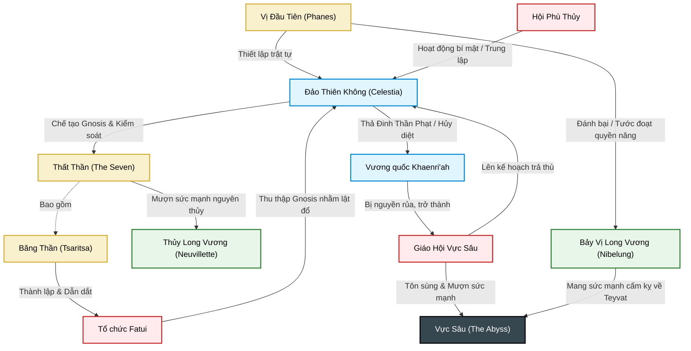

# Đồ Thị Tri Thức Lõi Genshin Impact

Dưới đây là sơ đồ mạng lưới biểu diễn các mối quan hệ quyền lực, đối kháng và nguồn gốc của các thế lực tối cao trong lục địa Teyvat.

## 1. Sơ đồ Quyền Lực & Đối Kháng (Core Power Graph)

## 2. Giải thích các mối liên kết chính
- **Màu sắc sơ đồ:**
  - `Màu Vàng (God):` Các thực thể Thần linh và Cấp cao nhất.
  - `Màu Xanh Biển (Nation):` Các khu vực, quốc gia.
  - `Màu Xanh Lá (Dragon):` Các thực thể Long Vương nguyên thủy.
  - `Màu Đỏ (Organization):` Các tổ chức và hội nhóm.
  - `Màu Đen (Abyss):` Vực sâu và các khái niệm bóng tối.
  
- **Xung đột 3 phe:** Sơ đồ chỉ rõ Teyvat hiện tại đang bị giằng xé bởi cuộc chiến ngầm giữa **Celestia** (phe bảo thủ duy trì trật tự cũ), **Fatui** (muốn lật đổ Celestia bằng chiến tranh Gnosis), và **Giáo Hội Vực Sâu** (muốn tái lập thế giới bằng sức mạnh hắc ám hủy diệt).
- **Quyền năng nguyên thủy:** Sự tuần hoàn quyền lực giữa Long Vương -> Bị tước đoạt làm Gnosis -> Thất Thần cai trị -> Focalors tự sát -> Neuvillette lấy lại quyền năng.
