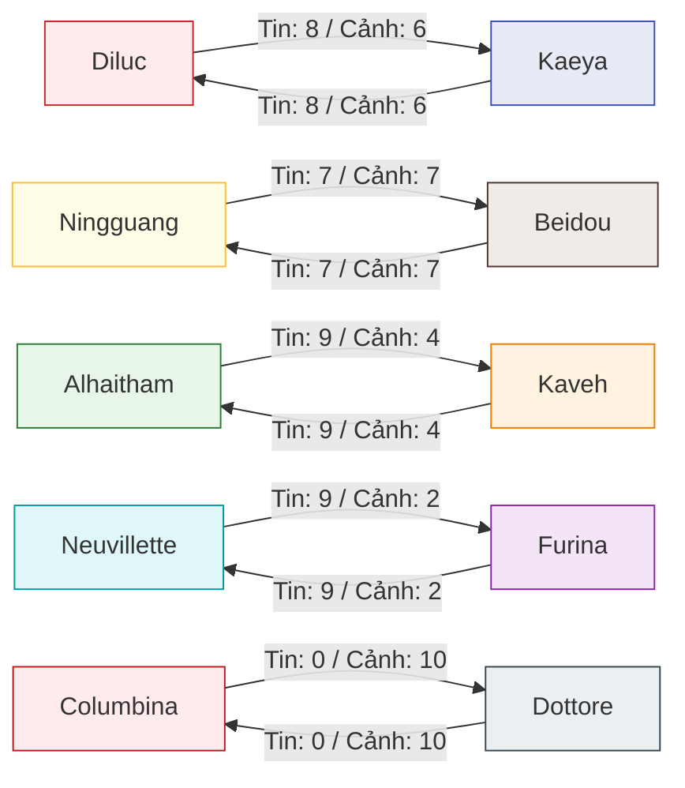
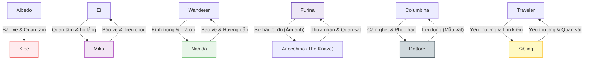
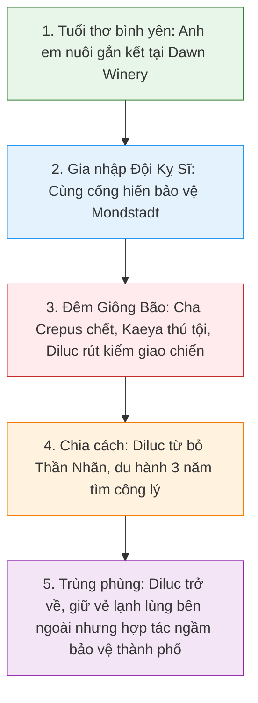
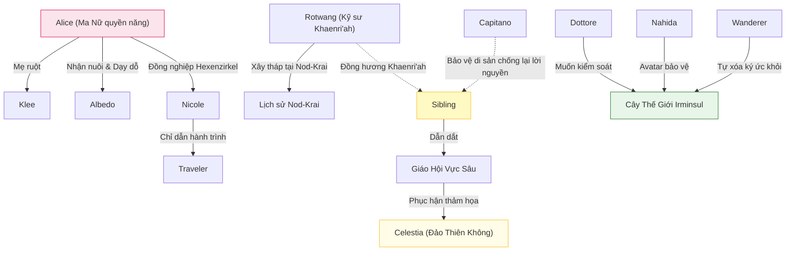

# ĐỒ THỊ MỐI QUAN HỆ NHÂN VẬT (RELATIONSHIP GRAPHS)
*Trực quan hóa các mối liên kết, điểm số tin tưởng, luồng cảm xúc, và dòng thời gian quan hệ giữa các nhân vật bằng sơ đồ Mermaid.*

---

## 1. Bản Đồ Mạng Lưới Quan Hệ Tổng Thể (Character Relationship Graph)
Sơ đồ mạng lưới biểu diễn các mối quan hệ đa dạng (Gia đình, Bạn bè, Đối thủ, Cấp trên/dưới) phân theo từng vùng.

```mermaid
graph TD
    subgraph Mondstadt ["Vùng Mondstadt"]
        Diluc["Diluc Ragnvindr"]
        Kaeya["Kaeya Alberich"]
        Albedo["Albedo"]
        Klee["Klee"]
        Jean["Jean Gunnhildr"]
        Lisa["Lisa Minci"]
    end

    subgraph Liyue ["Vùng Liyue"]
        Ningguang["Ningguang"]
        Beidou["Beidou"]
        Zhongli["Zhongli (Nham Thần)"]
        HuTao["Hu Tao"]
        Xingqiu["Xingqiu"]
        Chongyun["Chongyun"]
    end

    subgraph Inazuma ["Vùng Inazuma"]
        Ei["Raiden Shogun (Ei)"]
        Miko["Yae Miko"]
        Ayato["Kamisato Ayato"]
        Ayaka["Kamisato Ayaka"]
        Itto["Arataki Itto"]
        Sara["Kujou Sara"]
    end

    subgraph Sumeru ["Vùng Sumeru"]
        Alhaitham["Alhaitham"]
        Kaveh["Kaveh"]
        Cyno["Cyno"]
        Tighnari["Tighnari"]
        Nahida["Nahida (Thảo Thần)"]
        Wanderer["Kẻ Lang Thang"]
    end

    subgraph Fontaine ["Vùng Fontaine"]
        Neuvillette["Neuvillette (Thủy Long)"]
        Furina["Furina (Cựu Thần)"]
        Lyney["Lyney"]
        Lynette["Lynette"]
        Freminet["Freminet"]
        Wriothesley["Wriothesley"]
        Clorinde["Clorinde"]
    end

    subgraph Natlan ["Vùng Natlan"]
        Mavuika["Mavuika (Hỏa Thần)"]
        Capitano["Capitano (Harbinger #1)"]
        Kinich["Kinich"]
        Ajaw["K'uhul Ajaw"]
    end

    subgraph Nod_Krai ["Vùng Nod-Krai & Snezhnaya"]
        Dottore["Dottore (Harbinger #2)"]
        Columbina["Columbina (Harbinger #3)"]
        Aino["Aino"]
        Ineffa["Ineffa"]
    end

    subgraph Global ["Không Gian Khác"]
        Traveler["Traveler (Nhà Lữ Hành)"]
        Sibling["Sibling (Anh Em Sinh Đôi)"]
        Nicole["Nicole (Hexenzirkel)"]
    end

    %% Các mối liên kết chính
    Diluc -- "Anh em nuôi / Đối thủ" --> Kaeya
    Albedo -- "Người bảo hộ" --> Klee
    Jean -- "Đồng nghiệp thân thiết" --> Lisa
    Ningguang -- "Đồng minh chính trị / Đối thủ" --> Beidou
    Zhongli -- "Khách khanh" --> HuTao
    Xingqiu -- "Bạn thân chí cốt" --> Chongyun
    Ei -- "Bạn thân ngàn năm" --> Miko
    Ayato -- "Anh trai / Gia chủ" --> Ayaka
    Itto -- "Đối thủ tự phong" --> Sara
    Alhaitham -- "Bạn cùng phòng / Đối thủ" --> Kaveh
    Cyno -- "Bạn thân" --> Tighnari
    Nahida -- "Người bảo hộ / Chủ quản" --> Wanderer
    Neuvillette -- "Đồng nghiệp 500 năm" --> Furina
    Lyney -- "Anh cả" --> Lynette
    Lyney -- "Anh cả" --> Freminet
    Wriothesley -- "Đồng minh tác chiến" --> Clorinde
    Mavuika -- "Đối thủ đáng kính" --> Capitano
    Kinich -- "Khế ước cộng sinh" --> Ajaw
    Columbina -- "Đối địch sinh tử" --> Dottore
    Aino -- "Bạn thân / Người chế tạo" --> Ineffa
    Traveler -- "Anh em sinh đôi" --> Sibling
    Nicole -- "Chỉ dẫn định mệnh" --> Traveler

    %% Class Styles
    classDef mondstadt fill:#e1f5fe,stroke:#0288d1,stroke-width:1px;
    classDef liyue fill:#fff9c4,stroke:#fbc02d,stroke-width:1px;
    classDef inazuma fill:#e1bee7,stroke:#7b1fa2,stroke-width:1px;
    classDef sumeru fill:#e8f5e9,stroke:#2e7d32,stroke-width:1px;
    classDef fontaine fill:#e0f7fa,stroke:#0097a7,stroke-width:1px;
    classDef natlan fill:#ffe0b2,stroke:#f57c00,stroke-width:1px;
    classDef nodkrai fill:#ffebee,stroke:#c62828,stroke-width:1px;
    classDef global fill:#f3e5f5,stroke:#8e24aa,stroke-width:1px;

    class Diluc,Kaeya,Albedo,Klee,Jean,Lisa mondstadt;
    class Ningguang,Beidou,Zhongli,HuTao,Xingqiu,Chongyun liyue;
    class Ei,Miko,Ayato,Ayaka,Itto,Sara inazuma;
    class Alhaitham,Kaveh,Cyno,Tighnari,Nahida,Wanderer sumeru;
    class Neuvillette,Furina,Lyney,Lynette,Freminet,Wriothesley,Clorinde fontaine;
    class Mavuika,Capitano,Kinich,Ajaw natlan;
    class Dottore,Columbina,Aino,Ineffa nodkrai;
    class Traveler,Sibling,Nicole global;
```

---

## 2. Đồ Thị Tin Tưởng & Cảnh Giác Hai Chiều (Trust & Alertness Graph)
Trực quan hóa điểm số Tin tưởng và Cảnh giác hai chiều giữa các cặp tiêu biểu (thang điểm 0-10).

---

## 3. Đồ Thị Luồng Cảm Xúc Chủ Đạo (Emotional Graph)
Biểu thị các cảm xúc mạnh mẽ (Bảo vệ, Kính trọng, Căm ghét, Sợ hãi) một chiều giữa các nhân vật.

---

## 4. Đồ Thị Tuyến Tính Thời Gian (Relationship Timeline Graph)
Trực quan hóa sự phát triển mối quan hệ theo thời gian của cặp anh em Diluc ↔ Kaeya.

---

## 5. Đồ Thị Liên Kết Gián Tiếp (Hidden Connections Graph)
Biểu thị các mối quan hệ ẩn không thông qua gặp gỡ trực tiếp mà qua cùng tổ chức, mentor hoặc vận mệnh lịch sử.

