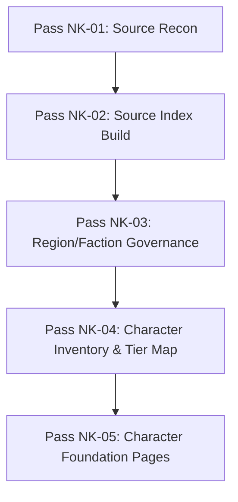

# Nod-Krai Next Actions (Pass NK-02)

This document establishes the roadmap and next steps for the Nod-Krai region pipeline following the completion of the source and provenance indexing pass (Pass NK-02).

---

## 1. Recommended Next Pass

We recommend proceeding to:
```text
Pass NK-03 — Nod-Krai Region / Faction Governance Notes
```

### Pre-requisites Met
* Pass NK-02 has successfully completed the registration of the 8 local source candidates in `wiki/sources/source-index.md`.
* A detailed source-to-claim-group map has been constructed, defining safety levels for all relevant claims.
* The quarantine and risk reports have established clear guardrails.

---

## 2. Scope of Pass NK-03

The upcoming pass should focus on:
1. **Region profile updates**: Structuring geography, subregions (Hiisi, Lempo, Paha), and pre-history.
2. **Faction governance notes**: Documenting the organization, history, and goals of the Frostmoon Scions, Lightkeepers, and other local factions.
3. **Power systems logic**: Formulating the mechanics of Kuuvahki, Varcolac shapeshifting, and the Fae calendar cycle based on the registered sources.
4. **Boundary preservation**: Ensuring that Dottore, Columbina, and Sandrone links remain guarded or blocked per the mapping established in Pass NK-02.

---

## 3. Subsequent Roadmap



### Note on Character Foundation Work
All character-specific updates (including inventory checks, voice guides, and page upgrades for playables like Lauma, Flins, Aino, or Harbingers like Columbina, Sandrone, Dottore) **MUST wait** until after the faction and regional governance notes of Pass NK-03 are completed and approved.
